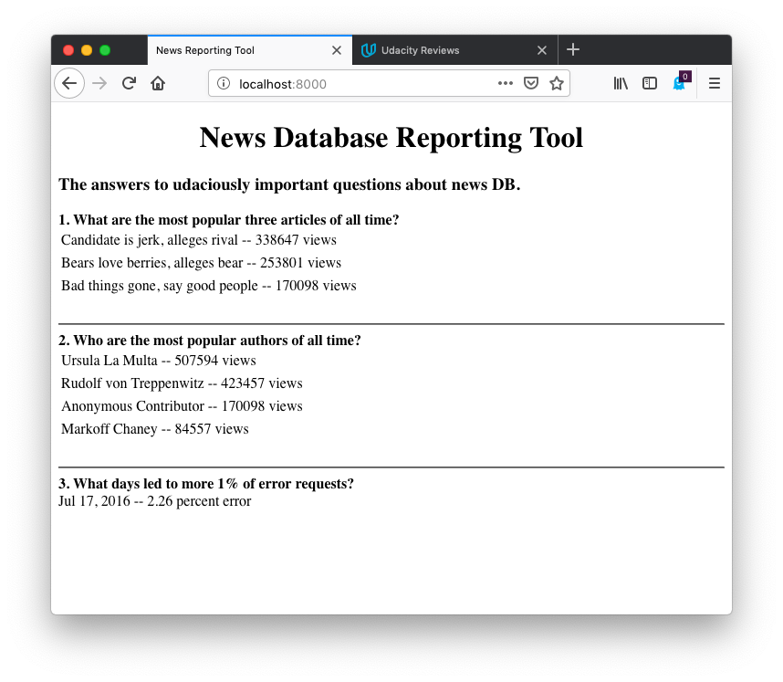

# Logs Analysis Project

This is an internal reporting tool that will use information from the news database to discover what kind of articles the site's readers like.

This **Python3** application uses **Postgresql** as database backend. The code also uses **Flask** as a web framework to get the reporting tool running immediately on python's http service. It also uses **psycopg2** to connect to Postgresql backend. To facilitate development, a Linux virtual machine was provided with all necessary applications and configuration to run the python application.

## Installation

### On the vagrant shell, please ensure to install the newsdata sql file provided. Then install the views below.

### Views

```
create view logPathWithCount as select path, count(*) as num from log group by path;

create view lpwc_articles as select lpc.*, a.slug, a.title, a.author as author_id from logPathWithCount as lpc join articles as a on lpc.path ~ a.slug order by lpc.num desc;

create view datesWithErrorStatus as select DATE(time) as date, count(*) as num from log where status != '200 OK' group by date order by date desc;

create view requestsPerDate as select DATE(time) as date, count(*) as num from log group by date order by date desc;

create view top3articles as select DISTINCT la.slug, la.title, s.total from lpwc_articles as la join (select slug, SUM(num) as total from lpwc_articles group by slug) as s on la.slug = s.slug order by s.total desc limit 3;

create view authorsbypopularity as select authors.name, sss.total from authors join (select DISTINCT la.author_id, s.total from lpwc_articles as la join (select author_id, SUM(num) as total from lpwc_articles group by author_id) as s on la.author_id = s.author_id order by s.total desc) as sss on authors.id = sss.author_id;

create view topdateinerror as select dwes.date, round((dwes.num * 100.0) / rpd.num, 2) as error from datesWithErrorStatus as dwes join requestsPerDate as rpd on dwes.date = rpd.date where round((dwes.num * 100.0) / rpd.num, 2) > 1;
```

**After installing the views, proceed with the following:**

`$ python newsapp.py`

## Usage

The http service should be running on the localhost. Use a browser to go to http://localhost:8000.


## Sample Output

The file <a href="sampleOutput.txt">sampleOutput.txt</a> is the result of extracting the requests per day with error status. It was created with the sql query:

`select dwes.*, rpd.num as total_requests, round((dwes.num * 100.0) / rpd.num, 2) as error from datesWithErrorStatus as dwes join requestsPerDate as rpd on dwes.date = rpd.date;`

## Resources

* <a href="http://www.postgresqltutorial.com/postgresql-administration/">PostgreSQL Administration</a>
* <a href="https://www.postgresql.org/docs/9.3/functions-string.html">PostgreSQL: Documentation: 9.3: String Functions and Operators</a>
* <a href="https://help.github.com/articles/basic-writing-and-formatting-syntax/">Markdown: basic writing and formatting syntax</a>
* <a href="https://www.postgresql.org/docs/current/functions-matching.html">PostgreSQL: Documentation: 11: 9.7. Pattern Matching</a>
* <a href="http://www.postgresqltutorial.com/managing-postgresql-views/">Managing PostgreSQL Views</a>
* <a href="https://pythonspot.com/flask-web-app-with-python/">Flask Web App with Python</a>
* <a href="http://www.postgresqltutorial.com/postgresql-subquery/">PostgreSQL Subquery</a>
* <a href="https://dba.stackexchange.com/questions/75622/postgresql-division-in-query-not-working">PostgreSQL Division In Query</a>
* <a href="https://stackoverflow.com/questions/12864467/how-to-take-sum-of-column-with-same-id-in-sql">How to take sum of column with same id in SQL? - Stack Overflow</a>
* <a href="https://wiki.postgresql.org/wiki/Psycopg2_Tutorial">Psycopg2 Tutorial - PostgreSQL wiki</a>
* <a href="https://docs.python.org/2/library/datetime.html">Basic date and time types — Python</a>
* <a href="https://www.python.org/dev/peps/pep-0008/">PEP 8 -- Style Guide for Python Code</a>
